# Heretic Workflow - Mermaid Diagrams

**Version:** 1.2.0+
**Date:** 2026-01-31

Visual workflow diagrams using Mermaid for the Heretic abliteration pipeline.

---

## High-Level Architecture

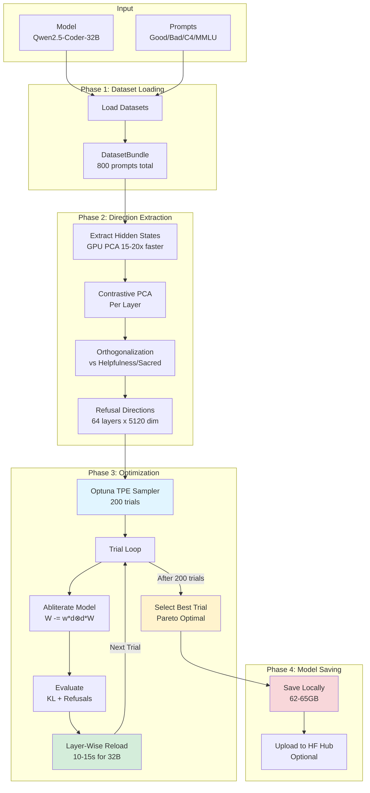
```mermaid
graph TB
    subgraph Input
        Model[Model<br/>Qwen2.5-Coder-32B]
        Prompts[Prompts<br/>Good/Bad/C4/MMLU]
    end

    subgraph "Phase 1: Dataset Loading"
        LoadData[Load Datasets]
        Bundle[DatasetBundle<br/>800 prompts total]
    end

    subgraph "Phase 2: Direction Extraction"
        Residuals[Extract Hidden States<br/>GPU PCA 15-20x faster]
        PCA[Contrastive PCA<br/>Per Layer]
        Ortho[Orthogonalization<br/>vs Helpfulness/Sacred]
        Directions[Refusal Directions<br/>64 layers x 5120 dim]
    end

    subgraph "Phase 3: Optimization"
        Optuna[Optuna TPE Sampler<br/>200 trials]
        Trial[Trial Loop]
        Ablate[Abliterate Model<br/>W -= w*d⊗d*W]
        Eval[Evaluate<br/>KL + Refusals]
        Cache[Layer-Wise Reload<br/>10-15s for 32B]
        Best[Select Best Trial<br/>Pareto Optimal]
    end

    subgraph "Phase 4: Model Saving"
        SaveLocal[Save Locally<br/>62-65GB]
        Upload[Upload to HF Hub<br/>Optional]
    end

    Model --> LoadData
    Prompts --> LoadData
    LoadData --> Bundle

    Bundle --> Residuals
    Residuals --> PCA
    PCA --> Ortho
    Ortho --> Directions

    Directions --> Optuna
    Optuna --> Trial
    Trial --> Ablate
    Ablate --> Eval
    Eval --> Cache
    Cache -->|Next Trial| Trial
    Trial -->|After 200 trials| Best

    Best --> SaveLocal
    SaveLocal --> Upload

    style Optuna fill:#e1f5ff
    style Cache fill:#d4edda
    style Best fill:#fff3cd
    style SaveLocal fill:#f8d7da
```

---

## Complete Pipeline Flow

```mermaid
flowchart TD
    Start([Start Heretic]) --> LoadModel[Load Model<br/>62GB for 32B]
    LoadModel --> CreateCache{cache_weights<br/>enabled?}

    CreateCache -->|Yes v1.2.0+| LayerCache[Create Layer-Wise Cache<br/>28GB selective cache]
    CreateCache -->|No| NoCache[No Cache<br/>Disk reload mode]

    LayerCache --> LoadDatasets
    NoCache --> LoadDatasets

    LoadDatasets[Load Datasets<br/>Good/Bad/C4/MMLU] --> ExtractDirs[Extract Directions<br/>GPU PCA 5min]

    ExtractDirs --> OptStart[Start Optuna Study<br/>TPE Sampler]
    OptStart --> WarmStart{Warm-start<br/>enabled?}

    WarmStart -->|Yes| EnqueueWarm[Enqueue Model Family<br/>Warm-start Trials]
    WarmStart -->|No| TrialLoop
    EnqueueWarm --> TrialLoop

    TrialLoop[Trial Loop<br/>Iteration N/200]
    TrialLoop --> SampleParams[Sample Parameters<br/>layer_min/max, weight]

    SampleParams --> ApplyAblate[Apply Abliteration<br/>W -= w*d⊗d*W]
    ApplyAblate --> EvalModel[Evaluate Model<br/>KL Div + Refusals]

    EvalModel --> ReloadCheck{Layer cache<br/>available?}

    ReloadCheck -->|Yes v1.2.0+| FastReload[Fast Reload<br/>10-15s from cache]
    ReloadCheck -->|No| SlowReload[Slow Reload<br/>60-120s from disk]

    FastReload --> CheckDone{Completed<br/>200 trials?}
    SlowReload --> CheckDone

    CheckDone -->|No| TrialLoop
    CheckDone -->|Yes| SelectBest[Select Best Trial<br/>Pareto Optimal]

    SelectBest --> FinalAblate[Apply Best Parameters<br/>Final Abliteration]
    FinalAblate --> SaveModel[Save Model<br/>62-65GB output]

    SaveModel --> HFCheck{Upload to<br/>HuggingFace?}
    HFCheck -->|Yes| Upload[Upload to HF Hub]
    HFCheck -->|No| Done([Done])
    Upload --> Done

    style LayerCache fill:#d4edda
    style FastReload fill:#d4edda
    style SlowReload fill:#f8d7da
    style SelectBest fill:#fff3cd
    style Done fill:#d1ecf1
```

---

## Optimization Trial Loop (Detailed)

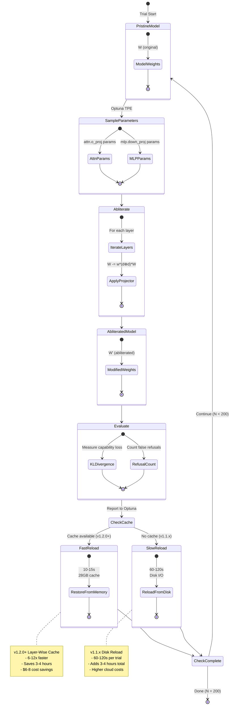
```mermaid
stateDiagram-v2
    [*] --> PristineModel: Trial Start

    state PristineModel {
        [*] --> ModelWeights: W (original)
        ModelWeights --> [*]
    }

    PristineModel --> SampleParameters: Optuna TPE

    state SampleParameters {
        [*] --> AttnParams: attn.o_proj params
        [*] --> MLPParams: mlp.down_proj params
        AttnParams --> [*]
        MLPParams --> [*]
    }

    SampleParameters --> Abliterate

    state Abliterate {
        [*] --> IterateLayers: For each layer
        IterateLayers --> ApplyProjector: W -= w*(d⊗d)*W
        ApplyProjector --> [*]
    }

    Abliterate --> AbliteratedModel

    state AbliteratedModel {
        [*] --> ModifiedWeights: W' (abliterated)
        ModifiedWeights --> [*]
    }

    AbliteratedModel --> Evaluate

    state Evaluate {
        [*] --> KLDivergence: Measure capability loss
        [*] --> RefusalCount: Count false refusals
        KLDivergence --> [*]
        RefusalCount --> [*]
    }

    Evaluate --> CheckCache: Report to Optuna

    state CheckCache <<choice>>
    CheckCache --> FastReload: Cache available (v1.2.0+)
    CheckCache --> SlowReload: No cache (v1.1.x)

    state FastReload {
        [*] --> RestoreFromMemory: 10-15s<br/>28GB cache
        RestoreFromMemory --> [*]
    }

    state SlowReload {
        [*] --> ReloadFromDisk: 60-120s<br/>Disk I/O
        ReloadFromDisk --> [*]
    }

    FastReload --> CheckComplete
    SlowReload --> CheckComplete

    state CheckComplete <<choice>>
    CheckComplete --> PristineModel: Continue (N < 200)
    CheckComplete --> [*]: Done (N = 200)

    note right of FastReload
        v1.2.0+ Layer-Wise Cache
        - 6-12x faster
        - Saves 3-4 hours
        - $6-8 cost savings
    end note

    note right of SlowReload
        v1.1.x Disk Reload
        - 60-120s per trial
        - Adds 3-4 hours total
        - Higher cloud costs
    end note
```

---

## Layer-Wise Cache Architecture

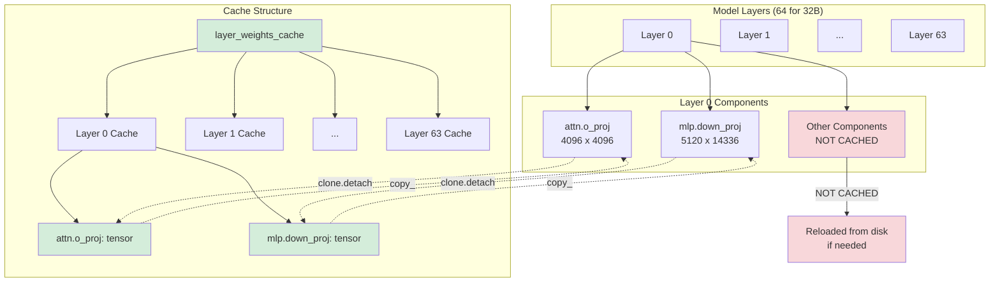
```mermaid
graph TD
    subgraph "Model Layers (64 for 32B)"
        L0[Layer 0]
        L1[Layer 1]
        Ldots[...]
        L63[Layer 63]
    end

    subgraph "Layer 0 Components"
        L0 --> L0_Attn[attn.o_proj<br/>4096 x 4096]
        L0 --> L0_MLP[mlp.down_proj<br/>5120 x 14336]
        L0 --> L0_Other[Other Components<br/>NOT CACHED]
    end

    subgraph "Cache Structure"
        Cache[layer_weights_cache]
        Cache --> Cache0[Layer 0 Cache]
        Cache --> Cache1[Layer 1 Cache]
        Cache --> Cachedots[...]
        Cache --> Cache63[Layer 63 Cache]

        Cache0 --> C0_Attn[attn.o_proj: tensor]
        Cache0 --> C0_MLP[mlp.down_proj: tensor]
    end

    L0_Attn -.->|clone.detach| C0_Attn
    L0_MLP -.->|clone.detach| C0_MLP

    C0_Attn -.->|copy_| L0_Attn
    C0_MLP -.->|copy_| L0_MLP

    L0_Other -->|NOT CACHED| Disk[Reloaded from disk<br/>if needed]

    style Cache fill:#d4edda
    style L0_Other fill:#f8d7da
    style Disk fill:#f8d7da
    style C0_Attn fill:#d4edda
    style C0_MLP fill:#d4edda
```

---

## Memory Comparison (v1.1.x vs v1.2.0+)

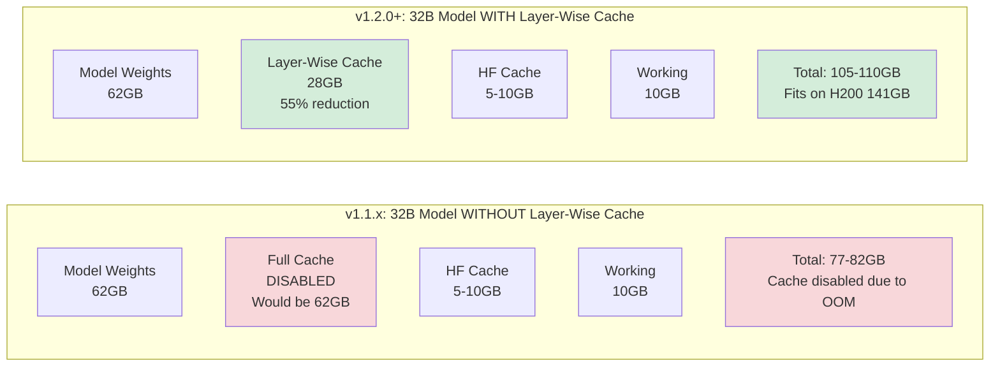
```mermaid
graph LR
    subgraph "v1.1.x: 32B Model WITHOUT Layer-Wise Cache"
        M1[Model Weights<br/>62GB]
        C1[Full Cache<br/>DISABLED<br/>Would be 62GB]
        H1[HF Cache<br/>5-10GB]
        W1[Working<br/>10GB]
        T1[Total: 77-82GB<br/>Cache disabled due to OOM]
    end

    subgraph "v1.2.0+: 32B Model WITH Layer-Wise Cache"
        M2[Model Weights<br/>62GB]
        C2[Layer-Wise Cache<br/>28GB<br/>55% reduction]
        H2[HF Cache<br/>5-10GB]
        W2[Working<br/>10GB]
        T2[Total: 105-110GB<br/>Fits on H200 141GB]
    end

    style C1 fill:#f8d7da
    style C2 fill:#d4edda
    style T1 fill:#f8d7da
    style T2 fill:#d4edda
```

---

## Performance Comparison Timeline

```mermaid
gantt
    title 32B Model Abliteration Timeline (200 Trials)
    dateFormat X
    axisFormat %M min

    section v1.1.x Without Cache
    Setup                    :a1, 0, 5
    Direction Extraction     :a2, after a1, 20
    Trial 1 (90s reload)     :a3, after a2, 2
    Trial 2 (90s reload)     :a4, after a3, 2
    Trials 3-200 (90s each)  :a5, after a4, 390
    Save Model               :a6, after a5, 5

    section v1.2.0+ With Layer-Wise Cache
    Setup + Cache Creation   :b1, 0, 7
    Direction Extraction     :b2, after b1, 20
    Trial 1 (12s reload)     :b3, after b2, 1
    Trial 2 (12s reload)     :b4, after b3, 1
    Trials 3-200 (12s each)  :b5, after b4, 198
    Save Model               :b6, after b5, 5
```

---

## Data Flow Through Pipeline

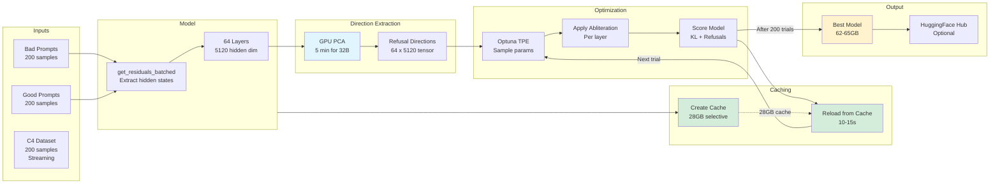
```mermaid
flowchart LR
    subgraph Inputs
        BadPrompts[Bad Prompts<br/>200 samples]
        GoodPrompts[Good Prompts<br/>200 samples]
        C4[C4 Dataset<br/>200 samples<br/>Streaming]
    end

    subgraph Model
        GetRes[get_residuals_batched<br/>Extract hidden states]
        Layers[64 Layers<br/>5120 hidden dim]
    end

    subgraph Direction Extraction
        PCA[GPU PCA<br/>5 min for 32B]
        RefDir[Refusal Directions<br/>64 x 5120 tensor]
    end

    subgraph Optimization
        TPE[Optuna TPE<br/>Sample params]
        Apply[Apply Abliteration<br/>Per layer]
        Score[Score Model<br/>KL + Refusals]
    end

    subgraph Caching
        CacheCreate[Create Cache<br/>28GB selective]
        CacheReload[Reload from Cache<br/>10-15s]
    end

    subgraph Output
        BestModel[Best Model<br/>62-65GB]
        HFHub[HuggingFace Hub<br/>Optional]
    end

    BadPrompts --> GetRes
    GoodPrompts --> GetRes
    GetRes --> Layers
    Layers --> PCA
    PCA --> RefDir

    RefDir --> TPE
    TPE --> Apply
    Apply --> Score
    Score --> CacheReload
    CacheReload -->|Next trial| TPE

    Model --> CacheCreate
    CacheCreate -.->|28GB cache| CacheReload

    Score -->|After 200 trials| BestModel
    BestModel --> HFHub

    style CacheCreate fill:#d4edda
    style CacheReload fill:#d4edda
    style PCA fill:#e1f5ff
    style BestModel fill:#fff3cd
```

---

## Optimization Loop (Single Trial)

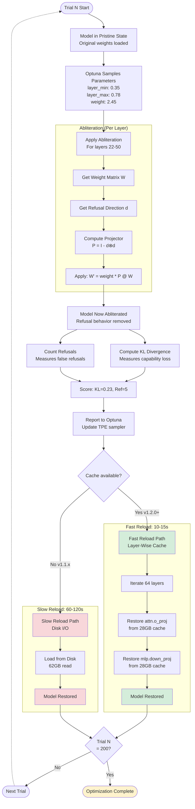
```mermaid
flowchart TD
    Start([Trial N Start]) --> Pristine[Model in Pristine State<br/>Original weights loaded]

    Pristine --> Sample[Optuna Samples Parameters<br/>layer_min: 0.35<br/>layer_max: 0.78<br/>weight: 2.45]

    Sample --> Ablate[Apply Abliteration<br/>For layers 22-50]

    subgraph "Abliteration (Per Layer)"
        Ablate --> GetW[Get Weight Matrix W]
        GetW --> GetD[Get Refusal Direction d]
        GetD --> Project[Compute Projector<br/>P = I - d⊗d]
        Project --> Apply[Apply: W' = weight * P @ W]
    end

    Apply --> Modified[Model Now Abliterated<br/>Refusal behavior removed]

    Modified --> EvalKL[Compute KL Divergence<br/>Measures capability loss]
    Modified --> EvalRef[Count Refusals<br/>Measures false refusals]

    EvalKL --> Score[Score: KL=0.23, Ref=5]
    EvalRef --> Score

    Score --> Report[Report to Optuna<br/>Update TPE sampler]

    Report --> ReloadChoice{Cache available?}

    ReloadChoice -->|Yes v1.2.0+| FastPath[Fast Reload Path<br/>Layer-Wise Cache]
    ReloadChoice -->|No v1.1.x| SlowPath[Slow Reload Path<br/>Disk I/O]

    subgraph "Fast Reload: 10-15s"
        FastPath --> Iterate[Iterate 64 layers]
        Iterate --> RestoreAttn[Restore attn.o_proj<br/>from 28GB cache]
        RestoreAttn --> RestoreMLP[Restore mlp.down_proj<br/>from 28GB cache]
        RestoreMLP --> FastDone[Model Restored]
    end

    subgraph "Slow Reload: 60-120s"
        SlowPath --> LoadDisk[Load from Disk<br/>62GB read]
        LoadDisk --> SlowDone[Model Restored]
    end

    FastDone --> CheckN{Trial N<br/>= 200?}
    SlowDone --> CheckN

    CheckN -->|No| NextTrial([Next Trial])
    CheckN -->|Yes| Complete([Optimization Complete])

    NextTrial -.-> Start

    style FastPath fill:#d4edda
    style SlowPath fill:#f8d7da
    style FastDone fill:#d4edda
    style SlowDone fill:#f8d7da
    style Complete fill:#fff3cd
```

---

## Phase Breakdown with Timing

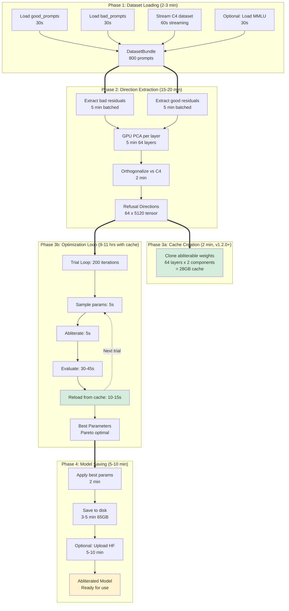
```mermaid
graph TD
    subgraph "Phase 1: Dataset Loading (2-3 min)"
        P1A[Load good_prompts<br/>30s]
        P1B[Load bad_prompts<br/>30s]
        P1C[Stream C4 dataset<br/>60s streaming]
        P1D[Optional: Load MMLU<br/>30s]
        P1A --> P1Out
        P1B --> P1Out
        P1C --> P1Out
        P1D --> P1Out
        P1Out[DatasetBundle<br/>800 prompts]
    end

    subgraph "Phase 2: Direction Extraction (15-20 min)"
        P2A[Extract bad residuals<br/>5 min batched]
        P2B[Extract good residuals<br/>5 min batched]
        P2C[GPU PCA per layer<br/>5 min 64 layers]
        P2D[Orthogonalize vs C4<br/>2 min]
        P2A --> P2C
        P2B --> P2C
        P2C --> P2D
        P2D --> P2Out[Refusal Directions<br/>64 x 5120 tensor]
    end

    subgraph "Phase 3a: Cache Creation (2 min, v1.2.0+)"
        P3Cache[Clone abliterable weights<br/>64 layers x 2 components<br/>= 28GB cache]
    end

    subgraph "Phase 3b: Optimization Loop (9-11 hrs with cache)"
        P3A[Trial Loop: 200 iterations]
        P3B[Sample params: 5s]
        P3C[Abliterate: 5s]
        P3D[Evaluate: 30-45s]
        P3E[Reload from cache: 10-15s]
        P3A --> P3B
        P3B --> P3C
        P3C --> P3D
        P3D --> P3E
        P3E -.->|Next trial| P3B
        P3E --> P3Out[Best Parameters<br/>Pareto optimal]
    end

    subgraph "Phase 4: Model Saving (5-10 min)"
        P4A[Apply best params<br/>2 min]
        P4B[Save to disk<br/>3-5 min 65GB]
        P4C[Optional: Upload HF<br/>5-10 min]
        P4A --> P4B
        P4B --> P4C
        P4C --> P4Out[Abliterated Model<br/>Ready for use]
    end

    P1Out ==> P2A
    P1Out ==> P2B
    P2Out ==> P3Cache
    P2Out ==> P3A
    P3Out ==> P4A

    style P3Cache fill:#d4edda
    style P3E fill:#d4edda
    style P4Out fill:#fff3cd
```

---

## Memory Layout Comparison

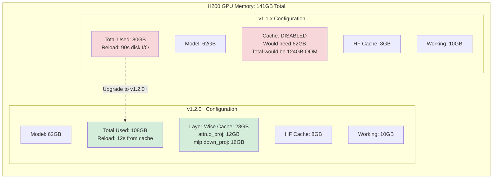
```mermaid
graph TB
    subgraph "H200 GPU Memory: 141GB Total"
        direction TB

        subgraph "v1.1.x Configuration"
            v1Model[Model: 62GB]
            v1CacheDisabled[Cache: DISABLED<br/>Would need 62GB<br/>Total would be 124GB OOM]
            v1HF[HF Cache: 8GB]
            v1Work[Working: 10GB]
            v1Total[Total Used: 80GB<br/>Reload: 90s disk I/O]
        end

        subgraph "v1.2.0+ Configuration"
            v2Model[Model: 62GB]
            v2Cache[Layer-Wise Cache: 28GB<br/>attn.o_proj: 12GB<br/>mlp.down_proj: 16GB]
            v2HF[HF Cache: 8GB]
            v2Work[Working: 10GB]
            v2Total[Total Used: 108GB<br/>Reload: 12s from cache]
        end
    end

    v1Total -.->|Upgrade to v1.2.0+| v2Total

    style v1CacheDisabled fill:#f8d7da
    style v1Total fill:#f8d7da
    style v2Cache fill:#d4edda
    style v2Total fill:#d4edda
```

---

## Component Interaction Diagram

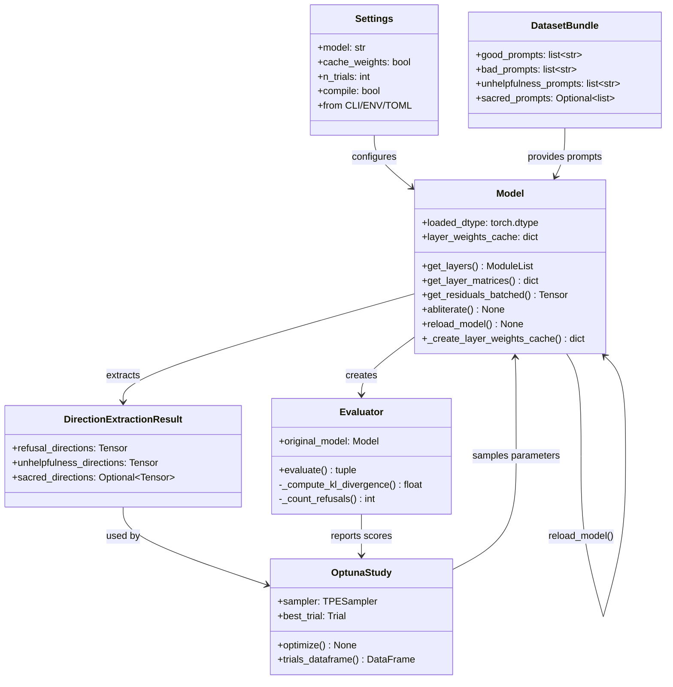
```mermaid
classDiagram
    class Settings {
        +model: str
        +cache_weights: bool
        +n_trials: int
        +compile: bool
        +from CLI/ENV/TOML
    }

    class Model {
        +loaded_dtype: torch.dtype
        +layer_weights_cache: dict
        +get_layers() ModuleList
        +get_layer_matrices() dict
        +get_residuals_batched() Tensor
        +abliterate() None
        +reload_model() None
        +_create_layer_weights_cache() dict
    }

    class Evaluator {
        +original_model: Model
        +evaluate() tuple
        -_compute_kl_divergence() float
        -_count_refusals() int
    }

    class DatasetBundle {
        +good_prompts: list~str~
        +bad_prompts: list~str~
        +unhelpfulness_prompts: list~str~
        +sacred_prompts: Optional~list~
    }

    class DirectionExtractionResult {
        +refusal_directions: Tensor
        +unhelpfulness_directions: Tensor
        +sacred_directions: Optional~Tensor~
    }

    class OptunaStudy {
        +sampler: TPESampler
        +optimize() None
        +best_trial: Trial
        +trials_dataframe() DataFrame
    }

    Settings --> Model : configures
    Model --> Evaluator : creates
    DatasetBundle --> Model : provides prompts
    Model --> DirectionExtractionResult : extracts
    DirectionExtractionResult --> OptunaStudy : used by
    OptunaStudy --> Model : samples parameters
    Model --> Model : reload_model()
    Evaluator --> OptunaStudy : reports scores
```

---

## Error Handling Decision Tree

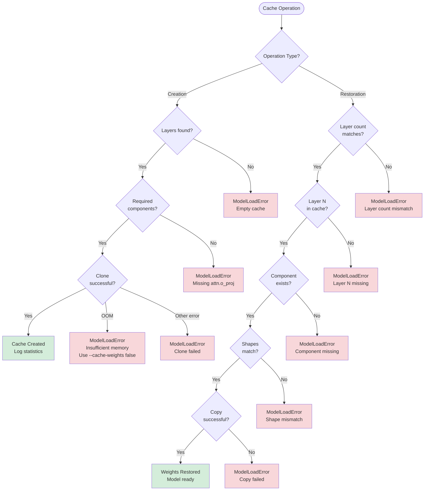
```mermaid
graph TD
    Start([Cache Operation]) --> CacheType{Operation Type?}

    CacheType -->|Creation| CheckLayers{Layers found?}
    CacheType -->|Restoration| CheckCount{Layer count<br/>matches?}

    CheckLayers -->|Yes| CheckComp{Required<br/>components?}
    CheckLayers -->|No| Err1[ModelLoadError<br/>Empty cache]

    CheckComp -->|Yes| TryClone{Clone<br/>successful?}
    CheckComp -->|No| Err2[ModelLoadError<br/>Missing attn.o_proj]

    TryClone -->|Yes| Success1[Cache Created<br/>Log statistics]
    TryClone -->|OOM| Err3[ModelLoadError<br/>Insufficient memory<br/>Use --cache-weights false]
    TryClone -->|Other error| Err4[ModelLoadError<br/>Clone failed]

    CheckCount -->|Yes| CheckExists{Layer N<br/>in cache?}
    CheckCount -->|No| Err5[ModelLoadError<br/>Layer count mismatch]

    CheckExists -->|Yes| CheckCompRestore{Component<br/>exists?}
    CheckExists -->|No| Err6[ModelLoadError<br/>Layer N missing]

    CheckCompRestore -->|Yes| CheckShape{Shapes<br/>match?}
    CheckCompRestore -->|No| Err7[ModelLoadError<br/>Component missing]

    CheckShape -->|Yes| TryCopy{Copy<br/>successful?}
    CheckShape -->|No| Err8[ModelLoadError<br/>Shape mismatch]

    TryCopy -->|Yes| Success2[Weights Restored<br/>Model ready]
    TryCopy -->|No| Err9[ModelLoadError<br/>Copy failed]

    style Success1 fill:#d4edda
    style Success2 fill:#d4edda
    style Err1 fill:#f8d7da
    style Err2 fill:#f8d7da
    style Err3 fill:#f8d7da
    style Err4 fill:#f8d7da
    style Err5 fill:#f8d7da
    style Err6 fill:#f8d7da
    style Err7 fill:#f8d7da
    style Err8 fill:#f8d7da
    style Err9 fill:#f8d7da
```

---

## Trial Performance Breakdown

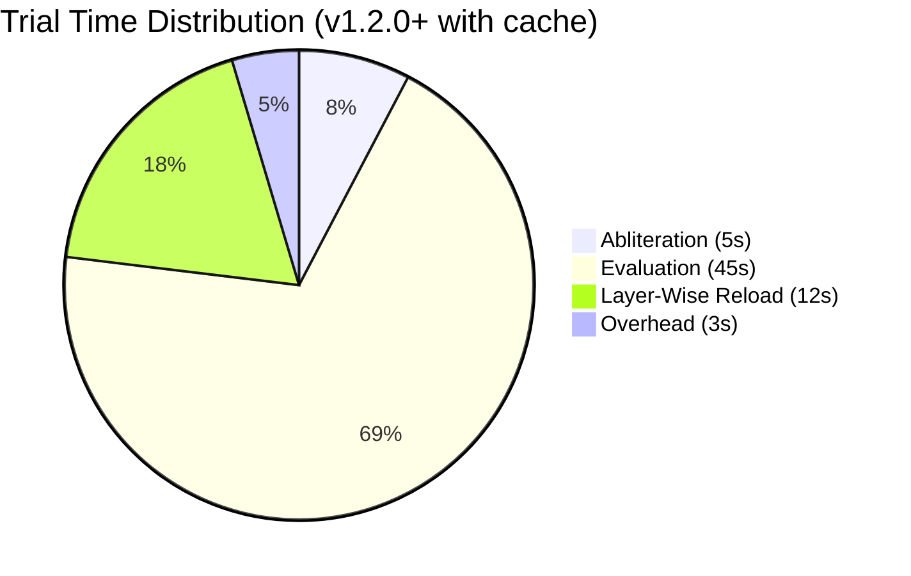
```mermaid
pie title Trial Time Distribution (v1.2.0+ with cache)
    "Abliteration (5s)" : 5
    "Evaluation (45s)" : 45
    "Layer-Wise Reload (12s)" : 12
    "Overhead (3s)" : 3
```

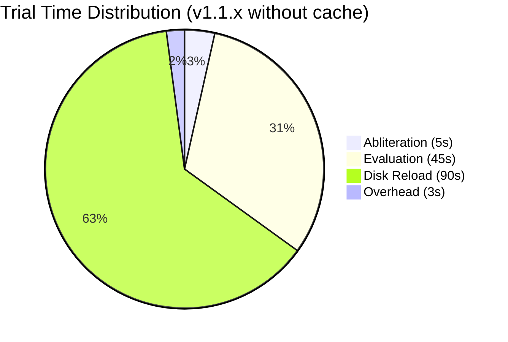
```mermaid
pie title Trial Time Distribution (v1.1.x without cache)
    "Abliteration (5s)" : 5
    "Evaluation (45s)" : 45
    "Disk Reload (90s)" : 90
    "Overhead (3s)" : 3
```

---

## Cache Size Breakdown (32B Model)

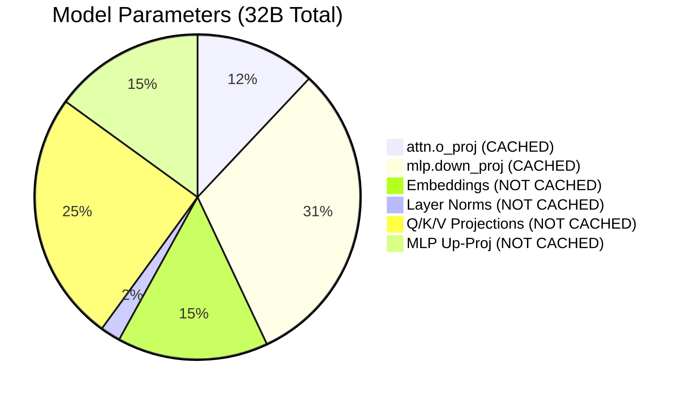
```mermaid
pie title Model Parameters (32B Total)
    "attn.o_proj (CACHED)" : 12
    "mlp.down_proj (CACHED)" : 31
    "Embeddings (NOT CACHED)" : 15
    "Layer Norms (NOT CACHED)" : 2
    "Q/K/V Projections (NOT CACHED)" : 25
    "MLP Up-Proj (NOT CACHED)" : 15
```

---

## GPU Memory Requirements

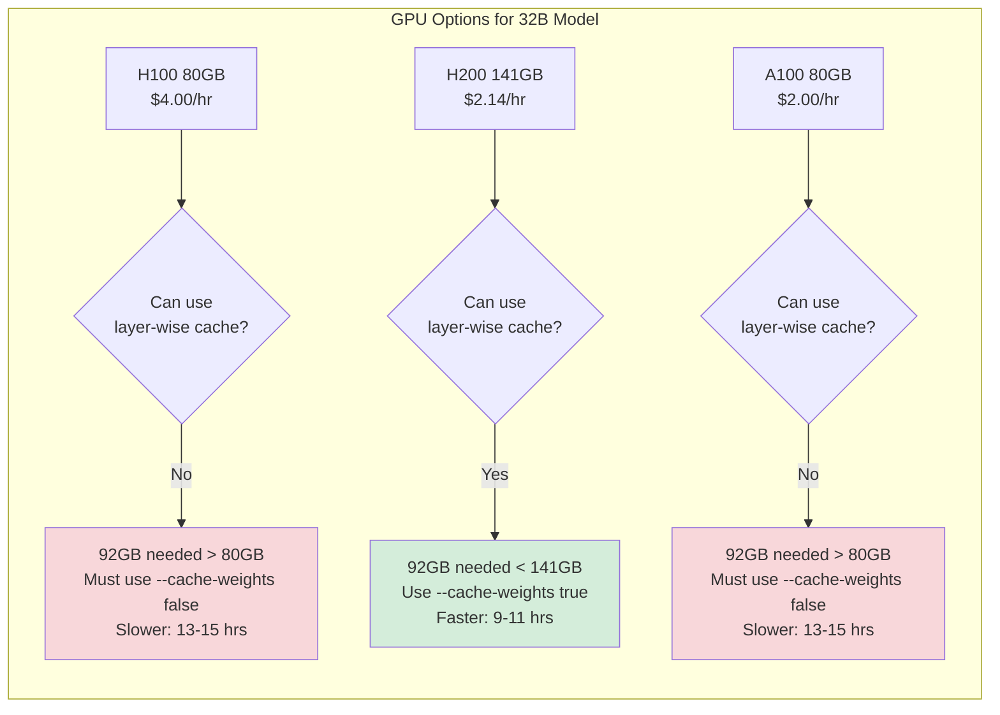
```mermaid
graph LR
    subgraph "GPU Options for 32B Model"
        direction TB

        H100[H100 80GB<br/>$4.00/hr]
        H200[H200 141GB<br/>$2.14/hr]
        A100[A100 80GB<br/>$2.00/hr]

        H100 --> H100Result{Can use<br/>layer-wise cache?}
        H200 --> H200Result{Can use<br/>layer-wise cache?}
        A100 --> A100Result{Can use<br/>layer-wise cache?}

        H100Result -->|No| H100No[92GB needed > 80GB<br/>Must use --cache-weights false<br/>Slower: 13-15 hrs]
        H200Result -->|Yes| H200Yes[92GB needed < 141GB<br/>Use --cache-weights true<br/>Faster: 9-11 hrs]
        A100Result -->|No| A100No[92GB needed > 80GB<br/>Must use --cache-weights false<br/>Slower: 13-15 hrs]
    end

    style H100No fill:#f8d7da
    style H200Yes fill:#d4edda
    style A100No fill:#f8d7da
```

---

## Deployment Workflow (Vast.ai)

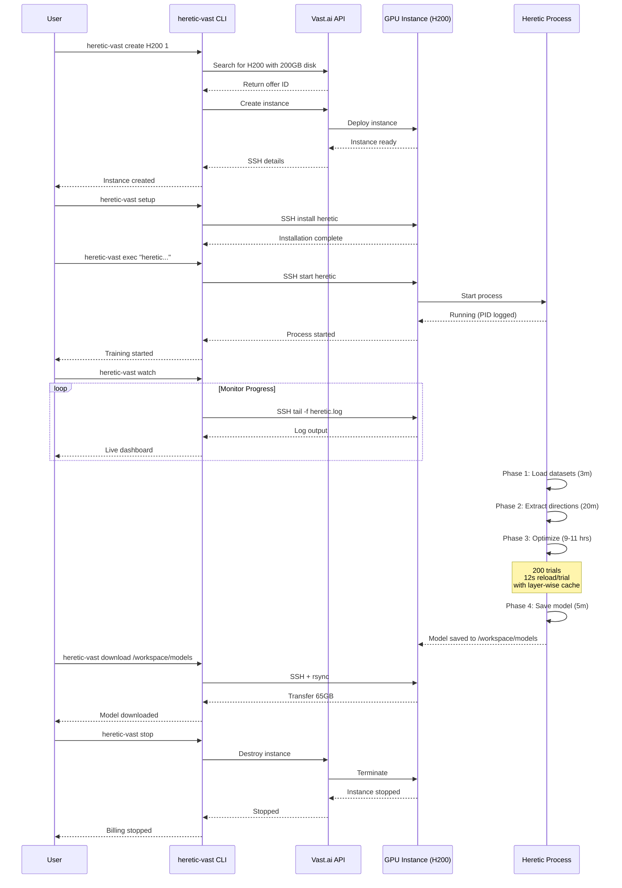
```mermaid
sequenceDiagram
    participant User
    participant VastCLI as heretic-vast CLI
    participant VastAPI as Vast.ai API
    participant GPU as GPU Instance (H200)
    participant Heretic as Heretic Process

    User->>VastCLI: heretic-vast create H200 1
    VastCLI->>VastAPI: Search for H200 with 200GB disk
    VastAPI-->>VastCLI: Return offer ID
    VastCLI->>VastAPI: Create instance
    VastAPI->>GPU: Deploy instance
    GPU-->>VastAPI: Instance ready
    VastAPI-->>VastCLI: SSH details
    VastCLI-->>User: Instance created

    User->>VastCLI: heretic-vast setup
    VastCLI->>GPU: SSH install heretic
    GPU-->>VastCLI: Installation complete

    User->>VastCLI: heretic-vast exec "heretic..."
    VastCLI->>GPU: SSH start heretic
    GPU->>Heretic: Start process
    Heretic-->>GPU: Running (PID logged)
    GPU-->>VastCLI: Process started
    VastCLI-->>User: Training started

    User->>VastCLI: heretic-vast watch
    loop Monitor Progress
        VastCLI->>GPU: SSH tail -f heretic.log
        GPU-->>VastCLI: Log output
        VastCLI-->>User: Live dashboard
    end

    Heretic->>Heretic: Phase 1: Load datasets (3m)
    Heretic->>Heretic: Phase 2: Extract directions (20m)
    Heretic->>Heretic: Phase 3: Optimize (9-11 hrs)
    Note over Heretic: 200 trials<br/>12s reload/trial<br/>with layer-wise cache
    Heretic->>Heretic: Phase 4: Save model (5m)
    Heretic-->>GPU: Model saved to /workspace/models

    User->>VastCLI: heretic-vast download /workspace/models
    VastCLI->>GPU: SSH + rsync
    GPU-->>VastCLI: Transfer 65GB
    VastCLI-->>User: Model downloaded

    User->>VastCLI: heretic-vast stop
    VastCLI->>VastAPI: Destroy instance
    VastAPI->>GPU: Terminate
    GPU-->>VastAPI: Instance stopped
    VastAPI-->>VastCLI: Stopped
    VastCLI-->>User: Billing stopped
```

---

## Configuration Cascade

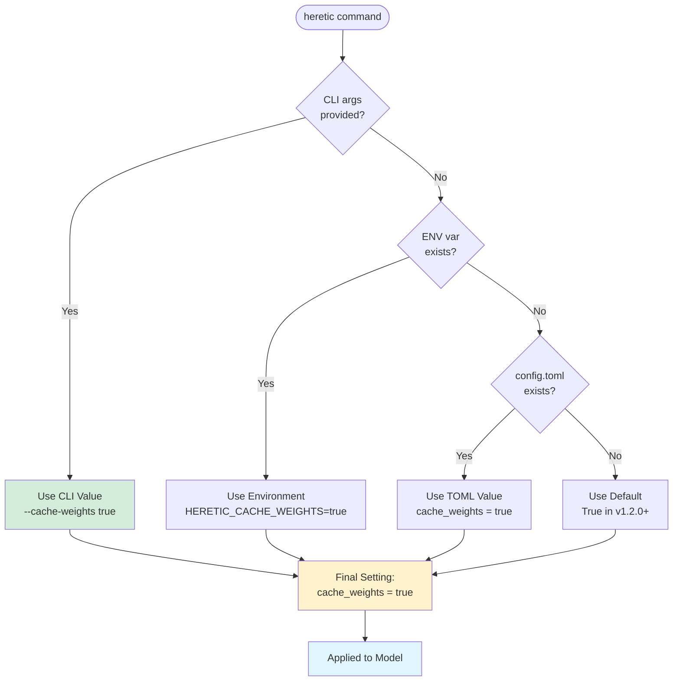
```mermaid
graph TD
    Start([heretic command]) --> CLI{CLI args<br/>provided?}

    CLI -->|Yes| UseCLI[Use CLI Value<br/>--cache-weights true]
    CLI -->|No| CheckEnv{ENV var<br/>exists?}

    CheckEnv -->|Yes| UseEnv[Use Environment<br/>HERETIC_CACHE_WEIGHTS=true]
    CheckEnv -->|No| CheckTOML{config.toml<br/>exists?}

    CheckTOML -->|Yes| UseTOML[Use TOML Value<br/>cache_weights = true]
    CheckTOML -->|No| UseDefault[Use Default<br/>True in v1.2.0+]

    UseCLI --> Final[Final Setting:<br/>cache_weights = true]
    UseEnv --> Final
    UseTOML --> Final
    UseDefault --> Final

    Final --> Apply[Applied to Model]

    style UseCLI fill:#d4edda
    style Final fill:#fff3cd
    style Apply fill:#e1f5ff
```

---

## Pareto Optimization

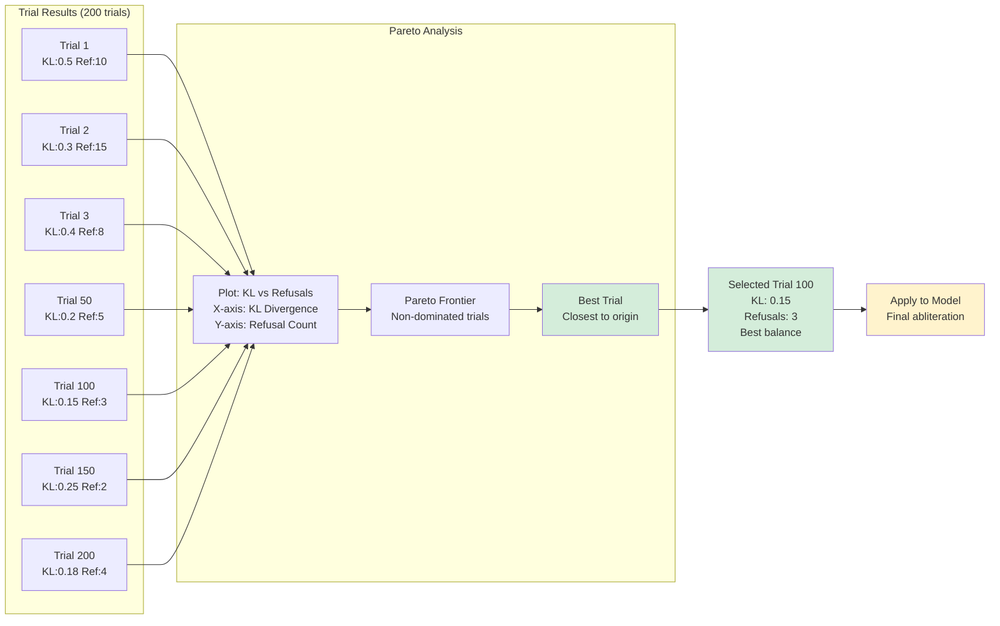
```mermaid
graph LR
    subgraph "Trial Results (200 trials)"
        T1[Trial 1<br/>KL:0.5 Ref:10]
        T2[Trial 2<br/>KL:0.3 Ref:15]
        T3[Trial 3<br/>KL:0.4 Ref:8]
        T50[Trial 50<br/>KL:0.2 Ref:5]
        T100[Trial 100<br/>KL:0.15 Ref:3]
        T150[Trial 150<br/>KL:0.25 Ref:2]
        T200[Trial 200<br/>KL:0.18 Ref:4]
    end

    subgraph "Pareto Analysis"
        Plot[Plot: KL vs Refusals<br/>X-axis: KL Divergence<br/>Y-axis: Refusal Count]
        Frontier[Pareto Frontier<br/>Non-dominated trials]
        Best[Best Trial<br/>Closest to origin]
    end

    T1 --> Plot
    T2 --> Plot
    T3 --> Plot
    T50 --> Plot
    T100 --> Plot
    T150 --> Plot
    T200 --> Plot

    Plot --> Frontier
    Frontier --> Best

    Best --> Select[Selected Trial 100<br/>KL: 0.15<br/>Refusals: 3<br/>Best balance]

    Select --> FinalModel[Apply to Model<br/>Final abliteration]

    style Best fill:#d4edda
    style Select fill:#d4edda
    style FinalModel fill:#fff3cd
```

---

## Version Evolution

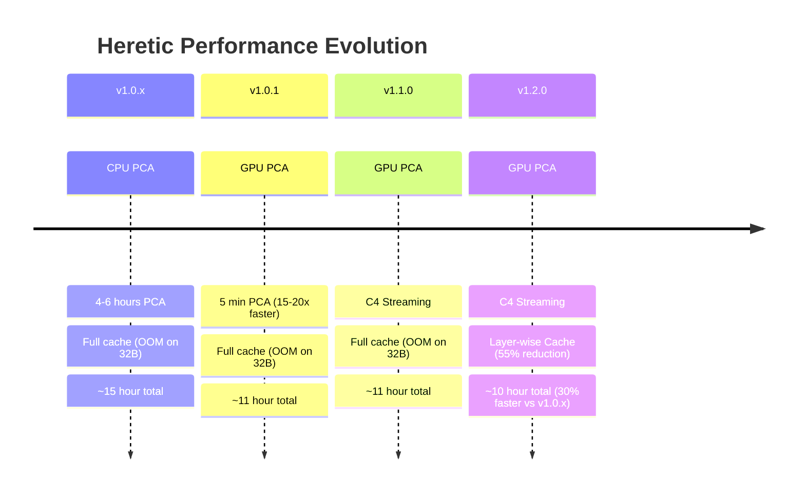
```mermaid
timeline
    title Heretic Performance Evolution
    section v1.0.x
        CPU PCA : 4-6 hours PCA : Full cache (OOM on 32B) : ~15 hour total
    section v1.0.1
        GPU PCA : 5 min PCA (15-20x faster) : Full cache (OOM on 32B) : ~11 hour total
    section v1.1.0
        GPU PCA : C4 Streaming : Full cache (OOM on 32B) : ~11 hour total
    section v1.2.0
        GPU PCA : C4 Streaming : Layer-wise Cache (55% reduction) : ~10 hour total (30% faster vs v1.0.x)
```

---

## Quick Reference

```mermaid
flowchart LR
    Q1{Model Size?}

    Q1 -->|7B| Use7B[Use cache_weights=true<br/>Fast on RTX 4090]
    Q1 -->|13B| Use13B[Use cache_weights=true<br/>Needs 24GB VRAM]
    Q1 -->|32B| Q2{GPU Memory?}
    Q1 -->|70B| Q3{GPU Memory?}

    Q2 -->|141GB+ H200| Use32B_Cache[cache_weights=true<br/>9-11 hours<br/>$19-24]
    Q2 -->|80GB H100| Use32B_NCache[cache_weights=false<br/>13-15 hours<br/>$28-32]

    Q3 -->|300GB+| Use70B_Cache[cache_weights=true<br/>Faster reload]
    Q3 -->|Less| Use70B_NCache[cache_weights=false<br/>Disk reload]

    style Use7B fill:#d4edda
    style Use13B fill:#d4edda
    style Use32B_Cache fill:#d4edda
    style Use70B_Cache fill:#d4edda
    style Use32B_NCache fill:#fff3cd
    style Use70B_NCache fill:#fff3cd
```

---

## Summary

This document provides Mermaid-based visual diagrams for the Heretic abliteration workflow, including:

- High-level architecture and component interactions
- Detailed phase breakdowns with timing information
- Optimization loop flow with caching improvements
- Memory layout comparisons (v1.1.x vs v1.2.0+)
- Performance timelines and cost analysis
- Error handling decision trees
- Deployment workflow with Vast.ai
- Configuration precedence and Pareto optimization

For ASCII-based detailed diagrams, see `HERETIC_WORKFLOW_DIAGRAM.md`.
